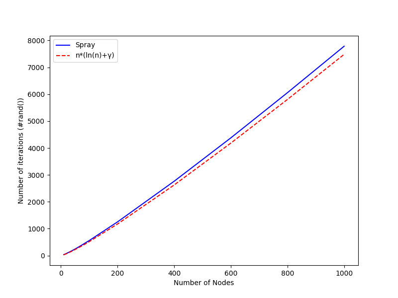

# Simulation of the Qasino model

It uses the PeerSim P2P simulator.

Requirements :
- Apache Maven 3.6.0
- Java 8 or Openjdk 11
- Python 3.7.3

```bash
mvn clean package
```

## Intermediate Results of all queries of the paper
| | TP1 | TP2  | TP3 | TP4  | TP5 | TP6  | TP7 | Total |
|---| --- | ---  | --- | ---  | --- | ---  | --- | --- |
| q17| 1 | 1  |  |   |  |   |  | 2 |
| q22 | 1 | 4213  |  |   |  |   |  | 4214 |
| q54 | 1 | 2889  | 1284 | 1284  |  |   |  | 5458 |
| q73 | 2 | 4213  | 2889 | 9670  | 1284 | 1284  |  | 19342 |
| q87 | 1 | 1  | 1 | 1  | 1 | 1  | 4 | 10 |


## Network size estimator
The estimator implemented is: Jelasity, M., & Montresor, A. (2004). Epidemic-style proactive aggregation in large overlay networks. In 24th International Conference on Distributed Computing Systems, 2004. Proceedings. (pp. 102-109). IEEE.


## Las Vegas

Number of iterations of the LV algorithms in order to get all nodes for different network size, against the approximation.



## Monte Carlo (one node execute a query)

Different number of nodes yet to be seen after an execution of the MC algorithm for different value of p (where p is the wanted proportion of nodes to reach)

The network size is set to 1000


## Monte Carlo (q nodes execute a query) for N = 1000 and p = 0.97

For all queries and a total of 100 runs, 
- left: this is the number of iterations needed for terminating the execution of the MC algorithm with different number of nodes executing the queries in the network and a p fixed to 0.97
- right: the proportion of completed executions for all runs in percentage

All results are available for each query in results/plots/p-0.97-q*.png


## The traffic in triples received using Invertible bloom lookup tables for each query 

An IBLT is set to perform a set difference over a maximum of 500 differences and alpha is set to 2
So an IBLT has a size of 1000 cells of 3 32-bits integers (keysum, hashsum, count). So an IBLT has a size of 32k bytes when sending over the network.

Query 17


Query 22


Query 54


Query 73


Query 87
